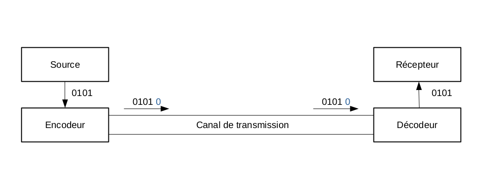
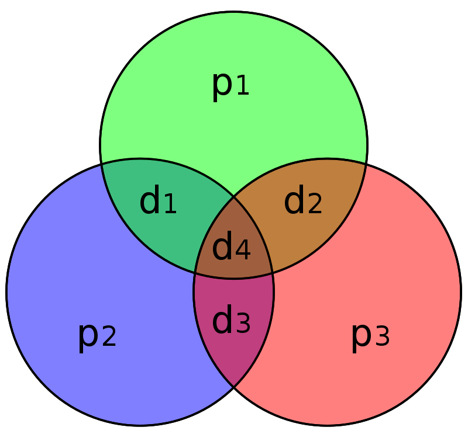
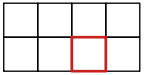
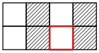
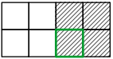
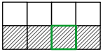

:matiere: Modélisation Mathématiques
:objet: Code Correcteur 
= {matiere} : {objet}
:autor: Axec Bacrie, Nathan Chaugier, Théo Chaves, William Touzani 
:toc: macro
:toc-title: Table des matières
:stem: 

'''
<<<

toc::[Title="Table des matières"]

<<<

'''
== I - Introduction aux Codes Correcteurs

=== I.1 **Le problème**
Dans un premier temps nous allons introduire la notion de code correcteur d’erreur. Quand un objet dit source émet un message binaire à un autre objet dit récepteur, le message doit passer par un canal de transmission. Cela peut être un câble ethernet, des ondes radio, etc. Il est alors possible qu’un bit soit erroné, la source émet 1011 et le récepteur reçoit 1010. Le récepteur n’a alors aucun moyen pour détecter l’erreur. Pour éviter cela on rajoute des bits au message dit de redondance qui détecteront l’erreur. +
Nous pouvons comparer cela avec le langage, quand nous voulons communiquer des informations à quelqu’un d’autre (nous sommes alors la source et l’autre personne le récepteur) nous utilisons le langage. Il peut arriver qu’avec le bruit ambiant un mot ou plusieurs dans une phrase soient mal compris. Cependant, grâce au contexte de la phrase, il nous est souvent possible de comprendre qu'un mot a mal été compris et donc, de demander à la source de répéter la phrase. Sans le contexte de la phrase il serait impossible de réinterpréter le mot. Nous allons donc essayer de donner du contexte à nos mots binaires ce qui se nomme un code correcteur. +
Pour mettre en place un code correcteur sur un canal de transmission, il faut rajouter un encodeur après la source pour ajouter les bits de redondances, et un décodeur avant le récepteur pour vérifier qu'il n'y ait pas d'erreur et enlever les bits de redondance. Bien sûr, si il y a une erreur, il doit soit demander à la source de ré-émettre le message ou le réparer.

.Mise en place d'un code correcteur sur un canal de transmission

=== I.2 **Le bit de parité**
Pour pallier ce problème, la solution la plus simple et la plus connue est le bit de parité. Il sert uniquement à détecter une erreur de transmission. Pour se faire, à la suite du mot que nous voulons protéger, nous y ajoutons un 0 si il y a un nombre pair de 1 ou un 1 si il y a un nombre impair de 1. Nous pouvons remarquer que si un mot comporte un bit de parité, il doit alors y avoir un nombre pair de 1. Si nous additionnons maintenant tous les bits du mots, le résultat doit être pair.

Notons un mot latexmath:[m] de latexmath:[n] bits latexmath:[b_n ..b_2 b_1 b_0] et latexmath:[P_m] la somme modulo 2 de tous ses bits. Dorénavant nous parlerons de sa parité, latexmath:[P_m = 0] si le mot latexmath:[m] contient un nombre pair de 1, et latexmath:[P_m = 1] si le mot latexmath:[m] contient un nombre impair de 1. +
Donc :
latexmath:[P_m \equiv \sum\limits_{\substack{i=0}}^{n}{b_i}\lbrack 2 \rbrack] et
latexmath:[P_m = \bigoplus \limits_{\underset{}{i=0}}^n b_i] +

====
Le signe latexmath:[\oplus] est le symbole du "xor" (ou exclusif) et à pour table de vérité :
[width=15%,float=center]
|===
^.^h|latexmath:[\oplus] ^.^h|0 ^.^h|1
^.^h|0
^.^|0
^.^|1
^.^h|1
^.^|1
^.^|0
|===
Et le latexmath:[\bigoplus] est au latexmath:[\oplus] ce que latexmath:[\sum] est au latexmath:[+].
====

L'ajout d'un bit de parité revient à ajouter à la fin de latexmath:[m] latexmath:[P_m], nous noterons ce nouveau mot latexmath:[b_m] (latexmath:[b_n ..b_2 b_1 b_0 P_m]) et latexmath:[P_b] sa parité.

latexmath:[P_b \equiv (P_m + P_m) \lbrack 2 \rbrack] +

si latexmath:[P_m = 0] +
alors : latexmath:[P_b \equiv (0 + 0) \lbrack 2 \rbrack \Rightarrow P_b = 0] +
et si latexmath:[P_m = 1] +
alors : latexmath:[P_b \equiv (1 + 1) \lbrack 2 \rbrack \Rightarrow P_b = 0] 

Nous pouvons remarquer donc que latexmath:[P_b] est forcément égal à 0. Si ce n'est pas le cas, nous pouvons alors constater qu'il y a au moins une erreur dans le mot. Cependant, nous ne pouvons pas corriger l'erreur. En plus de cela, si il y a un nombre pair de bits erronés, nous ne seront donc pas en mesure de détecter qu'il y ait des erreurs.

Nous allons maintenant calculer la probabilité qu'il y ait des erreurs dans un mot de 8 bits avec un bit de parité inclus, et que nous ne puissions pas les détecter. +
Nous prenons un taux d'erreur assez élevé de 1 sur 1000, c'est à dire que pour un bit, il y a une chance sur mille qu'il soit erroné. Cela peut correspondre à un mauvais résau wi-fi avec des intérférences comme la wi-fi des voisins, ou bien une distance trop grande parcourue par les ondes wi-fi.
Notons latexmath:[p] la probabilité qu'un bit soit erroné donc latexmath:[p = 10^{-3}], et latexmath:[X] la variable aléatoire qui compte le nombre de bit erroné sur un octet. latexmath:[X \hookrightarrow \mathscr{B}(8, 10^{-3})]. +
Calculons : 
latexmath:[\sum\limits_{\substack{i=1}}^{4}P(X = i \times 2) = P(X=2)+P(X=4)+P(X=6)+P(X=8)] +
latexmath:[P(X=k)=\binom{k}{8} \times p^{k} \times p^{8-k}] +
latexmath:[\Leftrightarrow \sum\limits_{\substack{i=1}}^{4}P(X = i \times 2) = \sum\limits_{\substack{i=1}}^{4}\binom{i \times 2}{8} \times p^{i \times 2} \times p^{8-i \times 2}] +
latexmath:[\Leftrightarrow \sum\limits_{\substack{i=1}}^{4}P(X = i \times 2) = \sum\limits_{\substack{i=1}}^{4}\binom{i \times 2}{8} \times 10^{-3^{i \times 2}} \times 10^{-3^{8-i \times 2}}] +
latexmath:[\Leftrightarrow \sum\limits_{\substack{i=1}}^{4}P(X = i \times 2) \approx 0.000028 ] +
La probabilité qu'il y ait des erreurs mais qu'elles ne soient pas détectées est d'environ d'une chance sur trente mille. Nous pouvons donc dire que dans la plupart des cas, un bit de parité par octet suffit à détecter toutes les erreurs sachant que nous avons pris un taux d'erreur élevé. Plus nous baisserons ce taux, plus la chance de ne pas détecter les erreurs diminuera. Néanmoins, il n'est pas possible de réparer un mot reçu avec une erreur et nous ne pouvons de plus, pas connaître le rang du bit erroné. Si le récepteur veut recevoir le bon mot, il est obligé de demander à nouveau à la source de d'émettre le même mot : c'est de cette manière que plusieurs protocoles fonctionnent : nous pouvons par exemple citer le protocole TCP. Nous pouvons aussi remarquer que, lorsqu'un octet possède plus d'une erreur, il y a alors de très grande chances que ce soit dû à une pertubation anormale et qu'un très grand nombre de bits soit erronés : ces anomalies sont alors facilement détectables. Donc latexmath:[X] ne suit pas vraiment une loi binomiale, mais le bit de parité reste très fiable pour protéger un mot d'un octet.

=== I.3 **Un code simple**

Nous présentons ici un exemple élémentaire de code correcteur obtenu en complétant une suite de trois nombres (constituant l'information à transmettre) par deux autres nombres (constituant le code de contrôle de l'information). L'ensemble des cinq nombres permet alors de détecter et de corriger une erreur qui se serait produite sur l'un des trois premiers nombres lors de la transmission. +
Soit donc un bloc de 3 nombres que l'on souhaite transmettre : 02 09 12 +
Ajoutons deux nombres de contrôle de l'information. +
Le premier est la somme des 3 nombres : 02 + 09 + 12 = 23 +
Le second est la somme pondérée des 3 nombres, chacun est multiplié par son rang : 02 x 1 + 09 x 2 + 12 x 3 = 56 +
À la sortie du codeur, le bloc à transmettre est : 02 09 12 23 56 +
À la suite d'une perturbation, le récepteur reçoit : 02 13 12 23 56 +
À partir des données reçues, le décodeur calcule : +
Sa somme simple : 02 + 13 + 12 = 27 +
Sa somme pondérée : 02 x 1 + 13 x 2 + 12 x 3 = 64 +
La différence entre la somme simple calculée (27) et celle reçue (23) indique la valeur de l'erreur : 4 (27-23 = 4) +
La différence entre la somme pondérée calculée (64) et celle reçue (56), elle-même divisée par la valeur de l'erreur indique la position où l'erreur se trouve : 2 ((64-56) / 4 = 2). +
Il faut donc retirer 4 au nombre du rang 2. +
Le bloc original est donc 02 (13-4=09) 12 23 56 +
Lors d'une transmission sans perturbation, les différences des sommes simples et des sommes pondérées sont nulles. 

=== I.4 **Les différents cas d'utilisation**
Les codes correcteurs sont utilisés partout  pour la Wi-Fi, pour la radio, pour la télévision, pour les disques durs… Mais ils sont aussi utiliser sur les cartes vitales, sur les QR codes, sur les codes barres, sur les numéros de carte bancaire, etc. +

==== L'exemple du code barre
Nous allons ici parler du code correcteur des codes barres, mais pour la plupart des exemples que nous avons cités, le principe est le même. De plus ici on parle plus de clé de détection d'erreur, car tout comme avec le bit de parité, nous voulons uniquement pouvoir détecter l'erreur et pas la réparer. +
Un code barre contient 30 barres qui représentent 13 chiffres organisés en trois parties.

.Exemple d'un code barre
image::img/code_barre.png[width=150,height=150]

La première partie comporte deux chiffres qui indiquent le pays d'où vient l'article (50 -> Grande-Bretagne ; 84 -> Espagne, 35 -> France). Donc ici 50. +
La deuxième partie comporte 5 chiffres identifiant le code de l'entreprise productrice : ici 12345. +
Enfin la troisième partie comporte 5 chiffres identifiant le code du produit défini par l'entreprise: ici 67890. +
Et donc le dernier chiffre est la clé de contrôle, ici 0. +
Pour calculer la clé de contrôle à partir des trois premières parties il faut : +

 * Ajouter les chiffres de rang impair en partant de la gauche.
 * Ajouter à ce résultat trois fois la somme des chiffres de rang pair toujours en partant de la gauche. 

On obtient asciimath:[R]. +
La clé de contrôle est le chiffre (entre 0 et 9) qui ajouté à R va donner un multiple de 10.

Exemple avec le code : +
5 0 1 2 3 4 5 6 7 8 9 0 +
latexmath:[(5+1+3+5+7+9)+ 3 \times (0+2+4+6+8+0) = 90] +
Donc la clé est 0 car 90 + 0 est un multiple de 10.

<<<
'''
== II - Le Code de Hamming

=== II.1 **Une approche intuitive**

==== L'objectif
Hamming travaillait sur un modèle de calculateur à carte perforée de faible fiabilité pour les laboratoires Bell, ce qui nuisait fortement au travail des ingénieurs. Hamming devait alors améliorer la fiabilité des calculateurs. Il se dit que si nous pouvions ajouter des bits de contrôle, nous pourrions alors rendre le calculateur grandement fiable. Mais il faut tout d'abord définir clairement les objectifs du code correcteur.

L'objectif du code est la transmission d'un message de quatre bits avec suffisamment de redondances pour que, même si une altération se produit, le récepteur soit capable de corriger automatiquement l'erreur. Le message envoyé est en conséquence plus long. Dans la pratique il contient sept bits : quatre composent le message et les trois autres servent à détecter et à corriger l'erreur, si nécessaire. 

====
Objectifs :

 * Le code doit pouvoir protéger 4 bits
 * Le code doit utiliser seulement 3 bits de redondances
 * Le code doit pouvoir réparer une erreur 
 * Si l'erreur est dans le code correcteur cela ne doit pas poser de problème
====

==== Le code parfait
Pour que le code soit parfait dans la situation de Hamming, c'est à dire qu'un mot de 4 bits passant par le canal de transmission puisse être reçu avec une erreur ou plus, il faut donc pour Hamming que le code correcteur puisse réparer le mot reçu si il y a une erreur et détecter si il y en a plus. De plus, il ne faut pas que la redondance soit trop grande : elle doit être optimisée pour que chaque état de la redondance soit associé à une information différente. Nous devons donc réparer un seul bit. Partons du principe qu'il y a une erreur ou moins dans le mot reçu. Il y a donc 5 possibilités : le bit erroné est asciimath:[d_1], asciimath:[d_2], asciimath:[d_3] ou asciimath:[d_4], mais il est aussi possible qu'aucun bit ne soit erroné. Cependant un code correcteur implique d'ajouter des bits de redondance et eux aussi peuvent être erronés. Prenons asciimath:[n] bits de redondances. il y a donc en tout asciimath:[5 + n] inforamtions à stocker dans les bits de redondance, et n bits peuvent décrire asciimath:[2^n] états différents. Par exemple sur deux bits nous pouvons décrire 4 états différents : 00, 01, 10, 11 ; ce qui correspond de compter de zéro à trois en base deux. Il faut donc que asciimath:[5 + n = 2^n] pour que la redondance soit minimale. Cette équation admet une unique solution : 3.

On pouvons généraliser cette équation si nous avons asciimath:[k] bits de message et asciimath:[n] bits de redondance. Pour que le code soit parfait, il faut alors que asciimath:[k+n+1 = 2^n].

==== Avec le bit de parité

.Représentation graphique

Cependant, il faut toujours trouver une manière d'encoder facilement les 8 informations dans les 8 états possibles des bits de parité. Pour cela, Hamming trouve une manière plutôt astucieuse de le faire : il code chaque bits de redondance comme un bit de parité de trois bits parmi les quatres. Ainsi asciimath:[p_1 = d_1 \oplus d_2 \oplus d_4], asciimath:[p_2 = d_1 \oplus d_3 \oplus d_4] et asciimath:[p_3 = d_2 \oplus d_3 \oplus d_4]. Nous pouvons le réprensenter graphiquement comme ci-contre. 

Il est maitenant plus facile de comprendre comment le code correcteur marche. Si le cercle vert donc asciimath:[p_1 \oplus d_1 \oplus d_2 \oplus d_4] est égal à zéro alors tous ces bits sont corrects. Cependant, imaginons qu'en additionnant les bits du cercle bleu nous obtienions asciimath:[p_2 \oplus d_1 \oplus d_3 \oplus d_4 = 1] et pour le cercle rose asciimath:[p_3 \oplus d_2 \oplus d_3 \oplus d_4 = 1]. Le bit qui n'est pas dans le cercle vert, mais dans les deux autres est erroné. Dans ce cas, le bit erroné est asciimath:[d_1] : il faut donc le corriger. De même, si les trois cercles sont erronés alors le bit à corriger est asciimath:[d_4]. Enfin, si un seul cercle est erroné, l'erreur provient du bit de parité au sein du code. 

Le tableau ci-dessus présente le récapitulatif de toutes les possibilités si il y a une seule erreur dans le message. Les sept colonnes correspondent aux sept possibles altérations des différents bits du message, et les trois lignes correspondent aux parités des cercles associés, c'est à dire l'addition de tous les bits dans ce même cercle.  

[#Tableau]
[cols="~,~,~,~,~,~,~,~"]
|===
^.^h|Bit # ^.^h|1 ^.^h|2 ^.^h|3 ^.^h|4 ^.^h|5 ^.^h|6 ^.^h|7
h|Bit erroné 
^.^h|asciimath:[p_1]
^.^h|asciimath:[p_2]
^.^h|asciimath:[d_1]
^.^h|asciimath:[p_3]
^.^h|asciimath:[d_2]
^.^h|asciimath:[d_3]
^.^h|asciimath:[d_4]
|Cercle rouge
^.^|0 
^.^|0
^.^|0 
^.^|1
^.^|1
^.^|1
^.^|1
|Cercle bleu
^.^|0 
^.^|1
^.^|1 
^.^|0
^.^|0  
^.^|1
^.^|1
|Cercle vert
^.^|1  
^.^|0 
^.^|1
^.^|0  
^.^|1  
^.^|0 
^.^|1
|===

Nous pouvons remarquer ici que chaque erreur entraine un jeu de parité différent. De plus, si toutes les parités sont à 0 alors le message ne contient pas d'erreur. Nous pouvons aussi remarquer qu'en plaçant les bits dans cet ordre là, nous pouvons lire par colonnes les nombres de un à sept en binaire. Ainsi le décodage du code correcteur sera plus simple, ce qui implique que le message asciimath:[d_1d_2d_3d_4] devient asciimath:[p_1p_2d_1p_3d_2d_3d_4] avec le code de Hamming. 

=== II.2 **Construction du code et décodage**

==== Code linéaire
Un code linéaire dispose d'une structure algébrique plus riche que celle du cadre général des codes correcteurs. L'ensemble E des messages à envoyer est celui de mots de quatre lettres prises dans l'ensemble {0,1}, le message est codé en un mot de sept lettres encore prises dans le même ensemble. On note F l'espace des mots de sept lettres binaires. E et F sont des espaces vectoriels.

====
Les tables d'addition et de multiplication sont les suivantes: +
[%noheader,width=50% ,cols="1,1",grid=none, frame=none, float=center]
|===
a|
[width=20%, cols="1,1,1"]
!===
^.^h!latexmath:[+] ^.^h!0 ^.^h!1
^.^h!0
^.^!0
^.^!1
^.^h!1
^.^!1
^.^!0
!===

a|
[width=20%, cols="1,1,1"]
!===
^.^h!latexmath:[\times] ^.^h!0 ^.^h!1
^.^h!0
^.^!0
^.^!0
^.^h!1
^.^!0
^.^!1
!===
|===
====

L' encodage, c’est-à-dire l'opération consistant à transformer le message de E de quatre lettres en un code de F de sept lettres apparait alors comme une application linéaire de E dans F. Elle se décrit par une matrice. Même si le corps est inhabituel, tous les résultats de l'algèbre linéaire s'appliquent ici. Pour cette raison, un tel code est dit linéaire. L'encodage consiste à multiplier le vecteur de quatre lettres binaires par une matrice 7x4 pour obtenir un vecteur composé de sept lettres binaires. 

==== Matrice génératrice
La connaissance de l'image de chaque vecteur de la base canonique détermine entièrement la matrice génératrice latexmath:[G].Les quatre vecteurs de la base conaonique correspondent aux messages suivants : latexmath:[d_1 = 1000], latexmath:[d_2 = 0100], latexmath:[d_3 = 0010] et latexmath:[d_4 = 0001]. Notons latexmath:[\sigma(d_1 d_2 d_3 d_4)] l'image du mot latexmath:[d_1 d_2 d_3 d_4]. +
latexmath:[\sigma(1000)=1110000], latexmath:[\sigma(0100)=1001100], latexmath:[\sigma(0010)=0101010] et latexmath:[\sigma(0001)=1101001] +
La matrice génératrice est formée des quatre colonnes correspondant aux images des vecteurs de la base canonique, on obtient:

[latexmath]
++++
\newcommand{\G}{
\begin{pmatrix}
1 & 1 & 0 & 1\\
1 & 0 & 1 & 1\\
1 & 0 & 0 & 0\\
0 & 1 & 1 & 1\\
0 & 1 & 0 & 0\\
0 & 0 & 1 & 0\\
0 & 0 & 0 & 1
\end{pmatrix}
}
\newcommand{\D}{
\begin{pmatrix}
1\\
0\\
1\\
1
\end{pmatrix}
}
\newcommand{\C}{
\begin{pmatrix}
0\\
1\\
1\\
0\\
0\\
1\\
1
\end{pmatrix}
}
\newcommand{\H}{
\begin{pmatrix}
0 & 0 & 0 & 1 & 1 & 1 & 1\\
0 & 1 & 1 & 0 & 0 & 1 & 1\\
1 & 0 & 1 & 0 & 1 & 0 & 1
\end{pmatrix}
}
\newcommand{\Ca}{
\begin{pmatrix}
0\\
1\\
1\\
0\\
1\\
1\\
1
\end{pmatrix}
}
\newcommand{\zer}{
\begin{pmatrix}
0 & 0 & 0 & 0\\
0 & 0 & 0 & 0\\
0 & 0 & 0 & 0
\end{pmatrix}
}
\newcommand{\res}{
\begin{pmatrix}
1 \\
0 \\
1 
\end{pmatrix}
}
\newcommand{\Ec}{
\begin{pmatrix}
0 \\
0 \\
0 \\ 
0 \\
1 \\
0 \\ 
0
\end{pmatrix}
}
G = \G
++++

[latexmath]
++++

++++

==== Exemple

.Exemple avec le mot 1011
image::img/exemple(7,4).png[width=250,height=250,float="right"]

Prenons comme exemple que la source veut protéger le mot asciimath:[d = 1011]. Les bits de parité sont alors égaux à zéro pour asciimath:[p_1], un pour asciimath:[p_2] et zéro pour asciimath:[p_3]. En respectant l'ordre des vecteurs de la base de asciimath:[F], nous obtenons manuellement le vecteur asciimath:[c = 0110011], donc le produit matriciel de asciimath:[G] la matrice génératrice par la matrice asciimath:[D] du vecteur asciimath:[d] nous devons obtenir la matrice asciimath:[C] du vecteur asciimath:[c].

[latexmath]
++++
G \times D = \G\D = \C 
++++

==== Matrice de contrôle
Une approche analogue à celle de l'encodage permet la détection d'erreur. Trois conditions doivent être remplies, une par cercle de la figure représentative. Chaque condition s'exprime comme une somme devant être paire, ou encore nulle dans le corps binaire. Ces trois conditions forment les trois lignes d'une matrice dite matrice de contrôle. Un message reçu est sans erreur si et seulement si le produit de la matrice de contrôle H par la matrice colonne C du vecteur c est égal à la matrice colonne nulle.

La condition associée au cercle rouge p3 signifie que la somme p3 + d2 + d3 + d4 doit être paire. La première ligne de la matrice correspond aux coordonnées 0001111. Cette ligne correspond à la première ligne du <<Tableau, tableau>> du paragraphe bit de parité. Il en est de même pour les autres lignes, correspondant aux cercles bleu et vert. On obtient la matrice H : 

[latexmath]
++++
H = \H
++++

De manière plus générale, il est possible de vérifier que le produit de H par G est bien nul, ce qui assure que tout message reçu est bien validé si aucune altération n'a été commise. 

[latexmath]
++++
H \times G = \H \G = \zer
++++

==== Correction d'erreur

Reprenons le mot asciimath:[c = 0110011] et rajoutons une erreur asciimath:[x = 0110111]. Le vecteur asciimath:[x] ne peut passer le test de la matrice de contrôle :

[latexmath]
++++
H \times X = \H \Ca = \res
++++

L'erreur est donc détectée, la matrice de contrôle présente un vecteur non nul, correspondant à la valeur 1012 en binaire, soit cinq. La correction associée correspond au mot latexmath:[e_5] composé de sept lettres égales à zéro sauf une, la cinquième est égale à un. Le décodage, dans le cas d'un syndrome non nul correspond à additionner l'erreur latexmath:[e_5] = 0000**1**00. On obtient : 

[latexmath]
++++
C =  X + E_5 = \Ca \Ec = \C
++++

=== II.3 **Code de Hamming en (8, 4)**
[#Hamming]

Nous venons de voir le code de Hamming en (7, 4) : 7 représentant le nombre de bits d'un mot et 4 le nombre de bits du message. C'est un code très performant quand il y a une seule erreur du fait que la correction est un simple calcul matriciel et qu'il n'y ait pas beaucoup de redondance. Cependant si il y a deux erreurs, le code va se comporter comme si il n'y avait qu'une erreur et va réparer une autre erreur. Par exemple, si asciimath:[p_1] est erronée et asciimath:[p_2] aussi, il va croire que c'est le bit asciimath:[d_1] qui est erroné. Reprenons le mot asciimath:[d = 1011] et donc asciimath:[c = 0110011] et inversons asciimath:[p_1] et asciimath:[p_2] nous avons asciimath:[c_1 = 1010011]. 

[latexmath]
++++
C_1 \times H = \Ca \H = \begin{pmatrix}0\\ 1\\ 1\end{pmatrix}
++++
Dans ce cas là, les erreurs sont donc aux bits asciimath:[p_1] et  asciimath:[p_2], mais le code corrigera le bit  asciimath:[d_1]. Pour corriger ce problème et de plus, compléter l'octet, nous pouvons rajouter un bit de parité asciimath:[p_4] des sept autres bits. De cette manière, si le code de Hamming(7,4) détecte une erreur, il vérifie que la somme des huit bits de l'octet est impair. Sinon, cela veut dire qu'il y a plus d'une d'erreur. Bien sûr si il y a trois, cinq ou sept erreurs le bit de parité ne pourra pas aider le code pour réparer le mots. Et si c'est le bit asciimath:[p_4] qui est erroné cela ne pose pas de problème car le code de Hamming(7,4) lui ne détectera pas d'erreur. En fait nous "encapsulons" le code de Hamming(7,4) avec un bit de parité. Donc avec le mot asciimath:[c = 0110011] cela devient asciimath:[c = 00110011] car le bit de parité vient se placer en première position.

== III - Généralisaton du code de Hamming

=== III.1 **Hamming en (7, 4)**

Nous avons vu le code de Hamming(7,4) et l'avons illustré par des diagrammes de Venn. Pour comprendre simplement le principe du code, nous allons maintenant comprendre comment ce code marche et comment nous pouvons l'agrandir grâce à une représentation en grille. 

[width=20%,float=center]
|===
^.^| ^.^h|asciimath:[p_1] ^.^h|asciimath:[p_2] ^.^|asciimath:[d_1]
^.^h|asciimath:[p_3]
^.^|asciimath:[d_2]
^.^|asciimath:[d_3]
^.^|asciimath:[d_4]
|===

==== Le jeu du "Qui est-ce ?"

Imaginons que dans cette grille il y ait une erreur mais nous ne savons pas où. Il faut donc être sûr qu'en trois questions (chaque question représente un bit de redondance) fermées, nous puissions connaître la position du bit erroné et ce,qu'importe où soit ce bit.
Nous devrons donc définir trois zones et chaque question sera du type : "L'erreur se trouve t-il dans cette zone ?". Il faut donc que chaque bit ait une combinaison de oui et de non unique. Pour se faire nous allons définir les zones de cette manière (les zones étant les parties hachurées):

.Représentation des trois zones
image::img/zone74.png[align="center"]

Nous allons prendre un exemple où il y a une erreur entourée en rouge :

.Grille avec erreur

Dans un premier, nous se demandons donc si l'erreur se trouve dans la zone 1, asciimath:[Q_1 = "L'erreur se trouve t-elle dans la zone 1 ?"] .

.Question 1

Non, l'erreur ne se trouve pas la première zone. Il ne reste donc plus que deux colonnes puis l'autre. Maintenant, nous nous demandons si l'erreur se trouve dans la zone 2, asciimath:[Q_2 = "L'erreur se trouve t-elle dans la zone 2 ?"] donc implicitement si l'erreur provient de la colonne une ou trois.

.Question 2

Et oui, l'erreur provient de la zone 2.Avec ces deux informations, nous pouvons déduire que l'erreur se trouve dans la troisième colonne. Maintenant, avec la réponse de la dernière question nous aurons saurons si l'erreur se trouve dans la première ligne ou la seconde. asciimath:[Q_3 = "L'erreur se trouve t-elle dans la zone 3 ?"] :

.Question 3

Enfin l'erreur se trouve dans la zone 3, et nous savons qu'elle se trouve dans la troisième colonne. Nous savons maitenant que le bit erroné est le sixième : asciimath:[d_3]. Chaque bit est représenté par un unique triplet de oui ou non, celui-ci donc part (Non, Oui, Oui). De cette manière nous pouvons donc remplir un tableau où chaque colonne représente une erreur différente, et chaque ligne une question où les "Oui" seront notés 1 et les "Non" seront notés 0.

[cols="~,~,~,~,~,~,~,~"]
|===
^.^h|Bit # ^.^h|1 ^.^h|2 ^.^h|3 ^.^h|4 ^.^h|5 ^.^h|6 ^.^h|7
h|Bit erroné 
^.^h|asciimath:[p_1]
^.^h|asciimath:[p_2]
^.^h|asciimath:[d_1]
^.^h|asciimath:[p_3]
^.^h|asciimath:[d_2]
^.^h|asciimath:[d_3]
^.^h|asciimath:[d_4]
|asciimath:[Q_3]
^.^|0 
^.^|0
^.^|0 
^.^|1
^.^|1
^.^|1
^.^|1
|asciimath:[Q_2]
^.^|0 
^.^|1
^.^|1 
^.^|0
^.^|0  
^.^|1
^.^|1
|asciimath:[Q_1]
^.^|1  
^.^|0 
^.^|1
^.^|0  
^.^|1  
^.^|0 
^.^|1
|===

Nous pouvons facilement remarquer la ressemblance avec le <<Tableau, tableau>> de la partie II : ils sont en fait les mêmes. Nous pouvons donc comprendre qu'avec un triplet de réponse nous saurons si un mot est erroné, et si oui, où est l'erreur.

==== Les bits de parités

Il faut maintenant trouver un façon de savoir si l'erreur est dans la ou les zones 1, 2 et 3 : pour se faire, Nous pouvons donc utiliser le bit de parité. Il y aura donc un bit de parité par zone : cela implique qu'il doit y avoir un nombre pair de un dans chaque zone. De plus, chaque bit de parité doit être uniquement dans sa propre zone. Le positionnement le plus logique et simple est celui-ci :

[width=20%,float=center]
|===
^.^| ^.^h|asciimath:[p_1] ^.^h|asciimath:[p_2] ^.^|asciimath:[d_1]
^.^h|asciimath:[p_3]
^.^|asciimath:[d_2]
^.^|asciimath:[d_3]
^.^|asciimath:[d_4]
|===

Nous commençons à comprendre cette ordre de bit qui pouvait nous sembler étrange. Et si nous numérotons chaque case par son index en binaire sur 3 bits comme ceci :

[width=20%,float=center]
|===
^.^| ^.^h|001 ^.^h|010 ^.^|011
^.^h|100
^.^|101
^.^|110
^.^|111
|===

Nous pouvons remarquer que la zone 1 est en fait l'ensemble des cases qui ont un index noté asciimath:[b_2b_{1}1], c'est à dire qui fini par un 1 comme "001" ou "111". Que la zone 2 est l'ensemble des cases qui ont un index noté asciimath:[b_2 1b_0] de même pour la zone 3 pour qui a l'ensemble des cases qui sont sous la forme asciimath:[1b_1b_0]. 

[%noheader,cols="1,1,1",grid=none, frame=none]
|=== 
a|

.Zone 1
[width=15%,cols="25%,25%,25%,25%"]
!===
^.^!ㅤ ^.^!00**1** ^.^!ㅤ ^.^!01**1**
^.^!
^.^!10**1**
^.^!
^.^!11**1**
!=== 

a|

.Zone 2
[width=15%,cols="1,1,1,1"]
!===
^.^!ㅤ ^.^!ㅤ ^.^!0**1**0 ^.^!0**1**1
^.^!
^.^!
^.^!1**1**0
^.^!1**1**1
!===

a|

.Zone 3
[width=15%,cols="1,1,1,1"]
!===
^.^!ㅤ ^.^! ^.^! ^.^!
^.^!**1**00
^.^!**1**01
^.^!**1**10
^.^!**1**11
!===

|===

Il est donc important de remarquer qu'en additionnant modulo 2 tous les index où le bit vaut 1, alors le résultat doit être asciimath:[000_2]. Prenons l'exemple de la zone 1 : cela sera la même logique pour toutes les autres zones. Avec le bit de parité il doit donc y avoir un nombre pair de 1 dans cette zone. Faisons l'addition modulo 2 des index notés asciimath:[b_2b_{1}1] dans cette zone, où le bit est à 1 et concentronons-nous sur les bits asciimath:[b_0] des index, ici, toujours égaux à 1. Alors, si il y a un nombre pair de un dans la zone, il y a un nombre pair de asciimath:[b_0] valant 1 qui s'additione. La somme congrue à 0 modulo 2.

Ce qui nous laisse penser que trouver l'erreur sera un jeu d'enfant.

==== Trouver l'erreur

Prenons le mot asciimath:[c = 0110011] et mettons le dans cette grille :

[width=20%,float=center]
|===
^.^| ^.^h|asciimath:[0_001] ^.^h|asciimath:[1_010] ^.^|asciimath:[1_011]
^.^h|asciimath:[0_100]
^.^|asciimath:[0_101]
^.^|asciimath:[1_110]
^.^|asciimath:[1_111]
|===

Et rajoutons une erreur :

[width=20%,float=center]
|===
^.^| ^.^h|asciimath:[0_001] ^.^h|asciimath:[1_010] ^.^|asciimath:[1_011]
^.^h|asciimath:[1_100]
^.^|asciimath:[0_101]
^.^|asciimath:[1_110]
^.^|asciimath:[1_111]
|===

Cherchons l'erreur à présent. Tout d'abord, gardons les cases où le bit est à 1 :

[width=20%,float=center,cols="1,1,1,1"]
|===
^.^| ^.^h| ^.^h|asciimath:[1_010] ^.^|asciimath:[1_011]
^.^h|asciimath:[1_100]
^.^|
^.^|asciimath:[1_110]
^.^|asciimath:[1_111]
|===

Puis faisons la somme modulo 2 de tous les index en base 2 des cases qui nous restent. +

latexmath:[010_2 \oplus 011_2 \oplus 100_2 \oplus 110_2 \oplus 111 = 100_2]

Cela nous donne l'index en base 2 du bit erroné. Et oui, si la somme des bits asciimath:[b_2] des index notés asciimath:[b_2b_1b_0] que nous avons gardé est égale à 1, alors il y a un nombre impair de 1 dans la zone 3 : cela implique que le bit erroné est dans la zone et que le rang du bit erroné est noté asciimath:[1b_{1}b_0]. Avec le même raisonnement pour toutes les autres zones, nous obtenons l'index de l'erreur asciimath:[100_2], c'est à dire l'index du bit asciimath:[p_3].

=== III.2 **De plus en plus grand**

==== Hamming en (15, 11)

Nous pouvons aussi agrandir le code pour protéger plus de bits cela peut être util quand le mot passe par un canal de transmission fiable, cela permet aussi d'avoir un taux bits de redondances sur bit de message moins élevé, donc pour un même nombre de bit de message à transmettre, on doit transmettre moins de bits de redondance. +
Si on rajoute deux ligne à la grille du code de Hamming(7,4) on rajoute alors huit bits. De plus en rajoutant deux colonnes on doit rajouter un seul bit de parité, et oui pour savoir dans laquel des quatres colonnes ce situe l'erreur il faut deux questions et de même pour les lignes il en faut donc quatre en tout. 

[%noheader,cols="1,1",grid=none, frame=none]
|=== 
a|

.Zone 1
[width=10%,cols="1,1,1,1"]
!===
^.^!ㅤ ^.^!000**1** ^.^!ㅤ ^.^!001**1**
^.^!
^.^!010**1**
^.^!
^.^!011**1**
^.^!
^.^!100**1**
^.^!
^.^!101**1**
^.^!
^.^!110**1**
^.^!
^.^!111**1**
!=== 

a|

.Zone 2
[width=10%,cols="1,1,1,1"]
!===
^.^!ㅤ ^.^!ㅤ ^.^!00**1**0 ^.^!00**1**1
^.^!
^.^!
^.^!01**1**0
^.^!01**1**1
^.^!
^.^!
^.^!10**1**0
^.^!10**1**1
^.^!
^.^!
^.^!11**1**0
^.^!11**1**1
!===

a|

.Zone 3
[width=10%,cols="1,1,1,1"]
!===
^.^!ㅤ ^.^! ^.^! ^.^!
^.^!0**1**00
^.^!0**1**01
^.^!0**1**10
^.^!0**1**11
^.^!ㅤ
^.^!
^.^!
^.^!
^.^!1**1**00
^.^!1**1**01
^.^!1**1**10
^.^!1**1**11
!===

a|

.Zone 4
[width=10%,cols="1,1,1,1"]
!===
^.^!ㅤ ^.^! ^.^! ^.^!
^.^!ㅤ
^.^!
^.^!
^.^!
^.^!**1**000
^.^!**1**001
^.^!**1**010
^.^!**1**011
^.^!**1**100
^.^!**1**101
^.^!**1**110
^.^!**1**111
!===

|===

On stocke le quatrième bit de parité dans le bit d'index 1000 en suivant la même logique que pour le code de Hamming(7, 4). Nous venons de créer le code de Hamming(15, 11) avec le même raisonnement qu'avec <<Hamming,Hamming(8, 4)>> on peut rajouter un seizième bit qui sera le bit de parité des quizes autre bits. Nous pouvons agrandir le code autant que nous le souhaitons. Pour qu'il reste parfait, il nous suffit d'ajouter un bit de redondances pour chaque dont nous doublons la taille de la grille. Nous pouvons ainsi avec 21 bits de redondances corriger une erreur parmi plus d'un million de bit, et en rajoutant un bit de parité nous pouvons repérer si il y a deux ou quatres ou six erreurs... Il faut donc choisir le code de Hamming le plus judicieux dans chaque cas de figure. Si nous avons un fort taux de bits erronés alors il nous faudra un code plus petit comme le 7, 4. Or, si nous avons un taux très bas, il nous faudra prendre un code plus grand. Il faut aussi prendre en compte le temps de calcul : vérifier un milllion de bits est plus long qu'en vérifier seulement seize.
